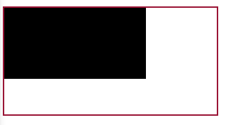
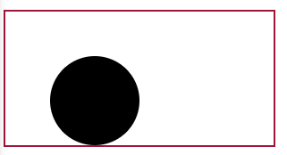
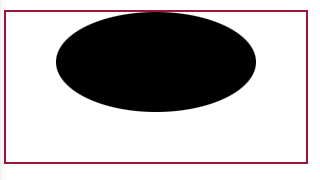
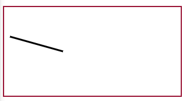
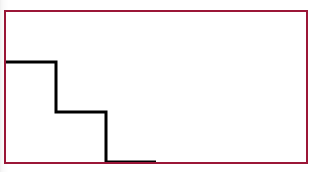
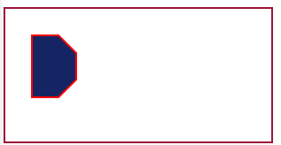
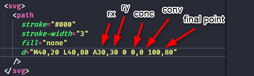
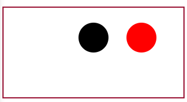
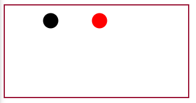

# SVG Structure
SVG files have a specific structure

## Cartesian Plane
To understand SVG is important to know how the cartesian plane works.


## ViewPort and ViewBox
The <strong>viewport</strong> is the space defined by the ```<svg>``` tag. Things that are outside of that, won't appear in the visualization.
```
<svg width="300px" height="100px" style="border:2px solid red; margin:0 auto; display:block;">
  <circle r="25" cx="0" cy="0"/>
</svg>
```
Above, for example, part of the circle stays outside of the port defined by the ```<svg>``` tag:


The <strong>viewbox</strong>, in its turn, is a property of the ````<svg>``` tag. ViewBox receive 4 values that, in order, represents:
* X axes (viewport movement in the X axes)
* Y axes (viewport movement in the Y axes)
* X proportion
* Y proportion

Summarizing, the ```viewBox``` determines the proportion of the viewPort size in the coordenates. It's as the resolution of the viewPort (zoom-in/out)
```
<svg width="300px" height="100px" viewBox="0 0 600 200" style="border:2px solid red; margin:0 auto; display:block;">
  <circle r="25" cx="150" cy="50"/>
</svg>
```

Now, decreasing the proportion of X and Y, but without moving on the coordinates and circle size, we will have this:
```
<svg width="300px" height="100px" viewBox="0 0 150 50" style="border:2px solid red; margin:0 auto; display:block;">
  <circle r="25" cx="150" cy="50"/>
</svg>
```


## preserveAspectRatio
Defines the behavior of the dimensions or of the image when the viewport changes.
```
<svg
    width="230" height="218"
    viewBox="0 0 230 218"
    preserveAspectRadio="">
</svg>
```
There are some values accepted:
* "none" = the image won't preserve its form if some dimension change.
* "< 1st value > < 2nd value >"
  * the 1st value is about the align of the image i the X and Y axes, alternating between Min, Mid and Max.
    *xMinYMin
    *xMidYMin
    *xMaxYMin
  * the 2nd value can be:
    * meet (cover the max the image can, without distortion)
    * slice (cut the image if it pass the viewport). The cut is done in the smallest measure according to the image proportion.

## Basic SVG forms
### Rect
```
<rect x="" y="" width="" height=""/>
```

### Circle
```
<circle r="" cx="" cy=""/>
```

### Ellipse
```
<ellipse rx="" ry="" cx="" cy=""/>
```

### Line
```
<line x1="10" y1="50" x2="100" y2="75" stroke="#000" stroke-width="3"/>
```

## Polyline
```
<polyline points="0,50 50,50 50,100 100,100 100,150 150,150" fill="transparent" stroke="#000" stroke-width="3"/>
```


## Polygon
```
<polygon points="30,30 60,30 80,50 80,80 60,100 30,100" fill="#152463" stroke="#F00" stroke-width="2"/>
```

## Path
This is the most complicated basic SVG element.
There are a lot of caracteristics to pass to this element
* Moveto (M) (describe the points we wanna in our curve)
* Lineto (L) (describes a line)
* Arcs (A) (describes an arch)
* Closepath (Z) (closes the path, joining its start with its end)
This caracteristics are declared inside the d property
```
<svg>
  <path 
    stroke="#000"
    stroke-width="3"
    fill="none"
    d="M40,20 L40,80 A30,30 0 0,0 100,80z"
  />
</svg>
```



## Containers Elements
This kind of element will draw nothing, but envolves the others

### defs
This container contains <strong>reusable</strong> items. The elements inside it, won't render if not called by the tag ```<use>```
```
<svg>
  <defs>
    <circle id="my-circle" r="25" cx="150" cy="50"/>
  </defs>

  <use xlink:href="#my-circle"/>
  <use xlink:href="#my-circle" x="80" fill="red"/>
</svg>
```

### g
This container agroup similar elements
```
<svg>
  <g fill="red">
    <circle id="my-circle" r="25" cx="150" cy="50"/>
    <circle id="my-circle" r="25" cx="250" cy="50"/>
  </g>
</svg>
```

### symbol
Defines an object that will be instantiated 
through the ```<use>``` and has its own viewBox.
```
<svg>
  <symbol id="my-symbol" viewBox="0 0 600 300">
    <circle r="25" cx="150" cy="50"/>
  </symbol>

  <use xlink:href="#my-symbol"/>
  <use xlink:href="#my-symbol" x="80" fill="red"/>
</svg>
```
