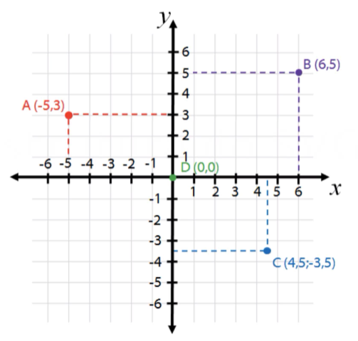
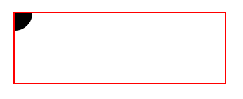
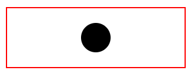
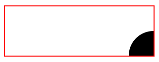

# SVG Structure
SVG files have a specific structure

## Cartesian Plane
Is important to know how the cartesian plane works.



## ViewPort and ViewBox
The <strong>viewport</strong> is the space defined by the ```<svg>``` tag. Things that are outside of that, won't appear in the visualization.
```
<svg width="300px" height="100px" style="border:2px solid red; margin:0 auto; display:block;">
  <circle r="25" cx="0" cy="0"/>
</svg>
```
Above, for example, part of the circle stays outside of the port defined by the ```<svg>``` tag:



The <strong>viewbox</strong>, in its turn, is a property of the ````<svg>``` tag. ViewBox receive 4 values that, in order, represents:
* X axes (viewport movement in the X axes)
* Y axes (viewport movement in the Y axes)
* X proportion
* Y proportion

Summarizing, the ```viewBox``` determines the proportion of the viewPort size in the coordenates. It's as the resolution of the viewPort (a zoom-in/out)
```
<svg width="300px" height="100px" viewBox="0 0 600 200" style="border:2px solid red; margin:0 auto; display:block;">
  <circle r="25" cx="150" cy="50"/>
</svg>
```

Now, decreasing the proportion of X and Y, but without moving on the coordinates and circle size, we will have this:
```
<svg width="300px" height="100px" viewBox="0 0 150 50" style="border:2px solid red; margin:0 auto; display:block;">
  <circle r="25" cx="150" cy="50"/>
</svg>
```



